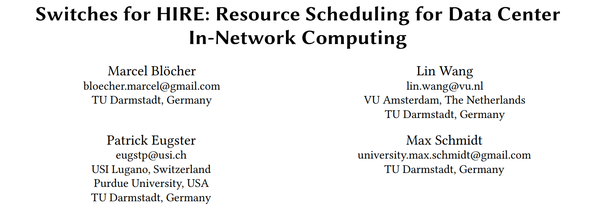
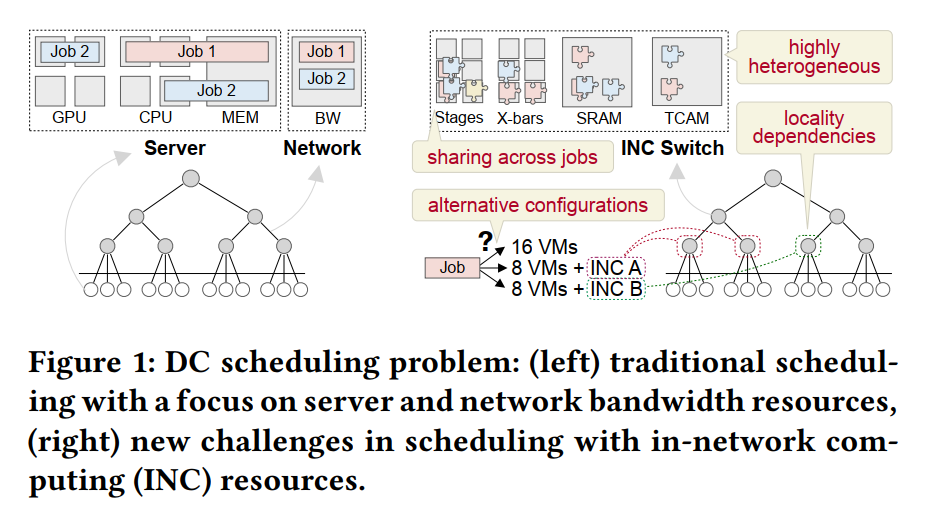
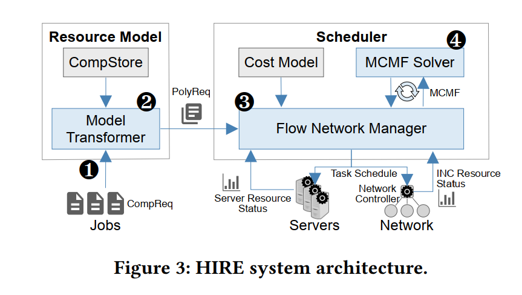
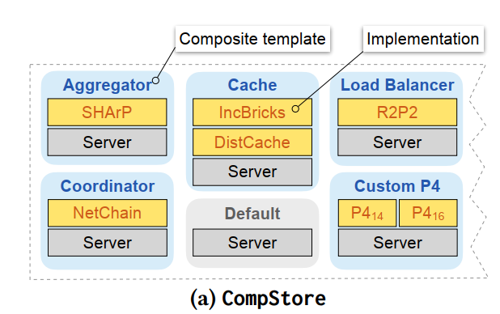
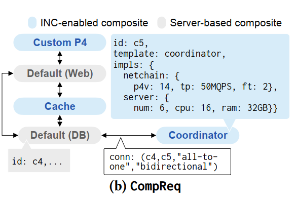
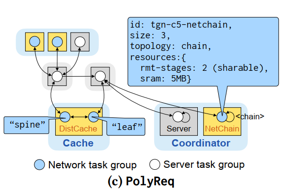
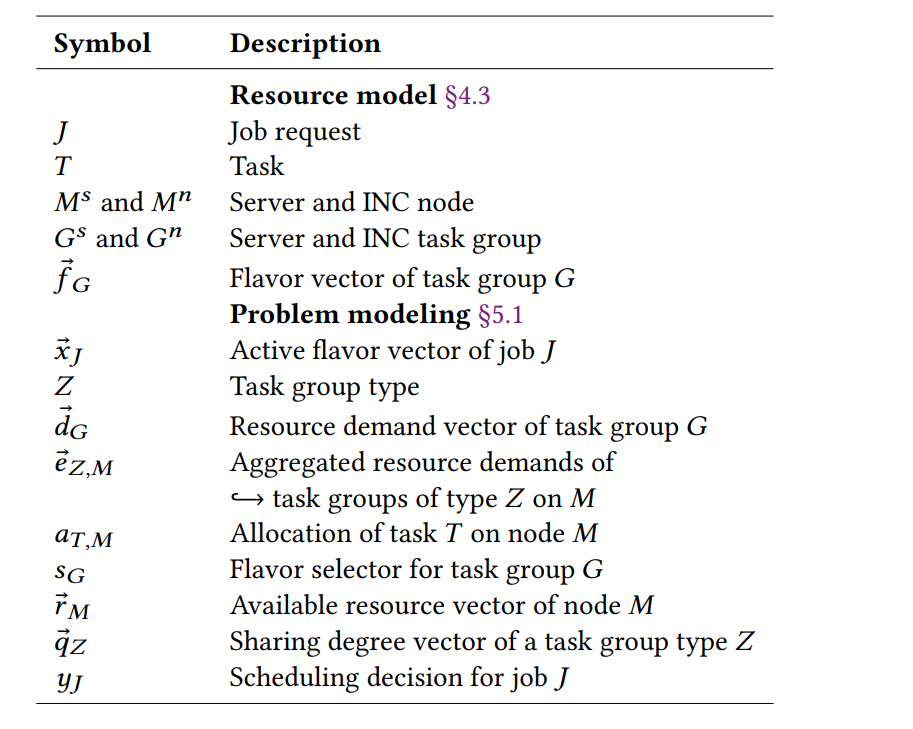
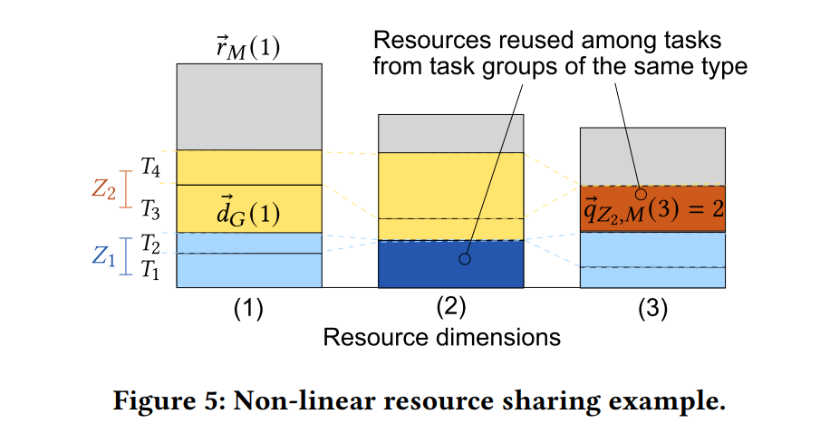
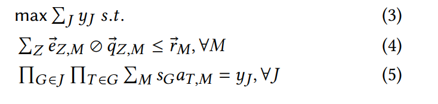
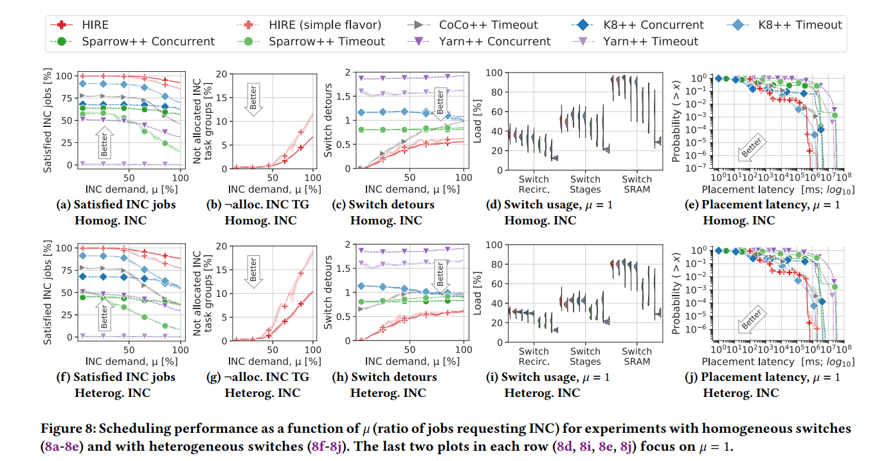

ASPLOS21_HIRE

[Wang Lin](https://linwang.info/)，阿姆斯特丹自由大学[高性能分布式计算组](https://www.vuhpdc.net/)的助理教授以及德国达姆施塔特工业大学的兼任教授，目前的主要研究领域是低延迟推理系统以及低延迟网内计算。这篇论文是低延迟网内计算领域的研究成果。

# TL;DR

本文研究的是在多租户数据中心背景下，如何在**多个**网内计算任务之间进行资源分配这一问题。针对这一问题，研究者提出了 HIRE 资源分配模型。

# 研究背景

研究者已经充分研究了云网络中的资源（CPU、GPU等）分配问题，并且已经产生了许多成熟的资源分配方案（K8s、Yarn、CoCo 等等）。然而，网内计算任务的资源分配不能简单地套用以上方案，原因如下：
- 传统数据中心中需要分配的资源主要是 CPU、内存、GPU、带宽；执行网内计算任务的数据中心还需要考虑可编程交换机的 stage、SRAM、X-bar、TCAM 等资源。计算资源的**异质性**（heterogeneity）使得资源分配问题变得更加复杂。
- 网内计算的资源具有**相互可替换性**（resource interchangeability）。举个例子，在网内聚合任务中，数据包可以在交换机上聚合，也可以在服务器上聚合，因此交换机的计算资源和服务器的计算资源是互相可以替换的。
- 网内计算中资源的分布位置往往更**固化**（locality）。举个例子，在网内聚合中我们往往更倾向于把可编程交换机部署在 ToR 的位置，而不是随便在网络中找一台交换机。
- 网内计算场景下，租户之间的资源共享是**非线性**的，即资源并不会均等地分给各个租户。在传统的云网络场景中，当我们分配服务器计算资源时，可以给每个租户分配一台虚拟机，并认为服务器资源均分给了这些租户。然而在网内计算场景下，存在资源（比如 stage）的重复利用问题。

# HIRE

HIRE 可以分为两个部分：资源模型 + 规划器：

文章引入了 **composite** 的概念。composite 指的是一个包含了多种网内计算/服务器实现方式的单位功能。举个例子，coordinator 是一个 composite，这个 composite 实现的是数据库的协调器功能，包含了 NetChain 和 server 两种实现方式。

用户通过 HIRE 提供的 API 输入自己网内聚合任务资源需求的描述（即 composite resource request, ComReq），Model Transformer 会把 ComReq 转换为 PolyReq 并发送给 Scheduler。Scheduler 会先把 PolyReq 转换为一张 flow network，然后求解 min-cost max-flow 问题，给出最终的资源规划解。

## HIRE 资源模型

### Composite Templates

在 CompStore 中有一些 composite 的模板，每个模板包含了一些实现方式（比如 coordinator 的模板中包含了 NetChain 和 server 两种实现方式）。每种实现方式都会向用户提供 API，让他们可以提供软硬件要求。用户也可以自定义一些模板（custom p4）。

### Composite Resource Requests

用户输入采用 CompReq（Composite Resource Requests）的形式。CompReq 是一个包含了多个 composite 的有向图，每个节点代表着一个 composite，有向箭头代表着依赖关系。

以上图为例，这个 CompReq 包含了 5 个 composite。其中，coordinator 这个 composite （id 是 c5）是由 coordinator 这个模板生成的，用户明确了两种实现方式：netchain 和 server。netchain 实现方式中，用户明确了 p4 语言的版本是 p414，吞吐量是 50MQPS，最多容许两个节点错误（fault tolerance, ft）；server 实现方式中，用户明确了需要 6 台服务器/虚拟机/容器、16 块 cpu、32GB 内存。

c4 和 c5 之间的有向箭头明确了 c4 到 c5 是多对一的对应关系，并且是双向关系。

### Polymorphic Resource Requests

HIRE 会将 CompReq 转换为 PolyReq，方便作为规划器的输入。PolyReq 是一些 task group 组成的图（在上图中，一个圆圈代表一个 task group）。一种实现方式可以被转换为一个 task group（比如上图的 coordinator 中，server 和 netchain 两种实现方式被分别转换为两个 task group），也可以被转换为多个 task group（比如 dist cache 这种实现方式被转换为两个 task group）

## HIRE 规划器

先介绍 flavor vector $\vec{f_G}$ 的概念：每个 task group 有一个形如 ⟨xxxx10xxx⟩ 的 flavor vector，其中：

- 0: 互斥；
- 1: 并行；
- x: 无关；

还是以上面的 PolyReq 为例，总共有 9 个 task group（9 个圆圈），所以 flavor vector 长度为 9。对于 coordinator 这个 composite，netchain 实现方式对应的 task group 的 flavor vector 是 ⟨xxxxxxx01⟩，同时 server 实现方式对应的 task group 的 flavor vector 是 ⟨xxxxxxx10⟩，意味着两个 task group 只能择其一执行。

规划器需要解决三个问题：

- 需要选择哪些 task group；
- 哪些 server 用来执行哪些 server task；
- 哪些 switch 用来执行哪些 INC task；

第二点和第三点可以概括为，如何把选中的 task group 映射到数据中心的资源上。

### Problem Modeling

- $J$: 代表一项工作（job）；
- $y_J$: 工作 $J$ 是否已经得到分配；
- $\vec{x}_J$: 工作 $J$ 的 flavor，结构类似之前介绍的 flavor vector，代表工作 $J$ 选取哪些 task group
- $s_G\in\{0,1\}$: 表示 task group $G$ 是否被选中，$s_G=if\ (\ ||\vec{x}_J \land \vec{f}_G||_1>0)$；
- $a_{T,M}\in\{0,1\}$: 表示 task $T$ 是否被分配到节点 $M$；
- $Z(G)$: 表示 task group $G$ 的属性。如果两个 task group 属性相同，那么他们可以分享具有 "sharable" 属性的资源。这里对应着我们之前提到的“非线性资源分配问题”。

以上图为例，$Z_1$ 和 $Z_2$ 代表 task group 的两种不同属性，$T_1,T_2$ 属于 $Z_1$，$T_3,T_4$ 属于 $Z_2$，有三种资源：(1)、(2) 和 (3)。资源 (1) 是不可共享的，所以四个 task 分别占据一部分资源；资源 (2) 和资源 (3) 可以共享，因此资源 (2) 中深蓝色的部分由 $T_1,T_2$ 共享，资源 (3) 中棕色的部分由 $T_3,T_4$ 共享。

最终问题的形式化定义如下，是一个整数规划问题：

三个式子分别对应：

- 最大化部署的任务数量；
- 资源约束；
- 决定任务是否部署的计算依据；即所有的 $s_G=1$ 的 task group $G$ 中，所有的 task $T$ 都至少分配到了一台机器 $M$ 上。

### Flow-Based Scheduling Approach

上述 IP 问题规模很大，所以本文提出了将规划问题转换为 min-cost max-flow 问题的 heuristic。这种方法最早见于（SOSP09, Quincy: fair scheduling for distributed computing clusters.），本文对这种方法做了一些 customization。

### HIRE Flow Network Structure

要弄明白这一节，需要对 Quincy 这篇文章的方法有基本的了解。

# Evaluation

四个评价指标：

- 得到合理资源分配的 INC 任务数目
- 交换机冗余
- 交换机负载
- 计算任务下发的尾延迟

## Retrofitting Existing Schedulers

本文将 HIRE 与四个已有的资源分配框架进行比较：

- K8s
- Yarn
- CoCo
- Sparrow

这些资源分配框架适用于非网内计算场景，并不能直接拿来对网内计算任务进行资源分配。本文对这四个方案进行了扩展，让他们可以支持网内计算任务场景，并将其称为 K8++、Yarn++、CoCo++、Sparrow++。

